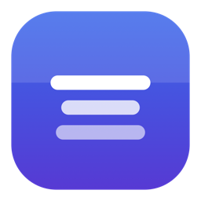
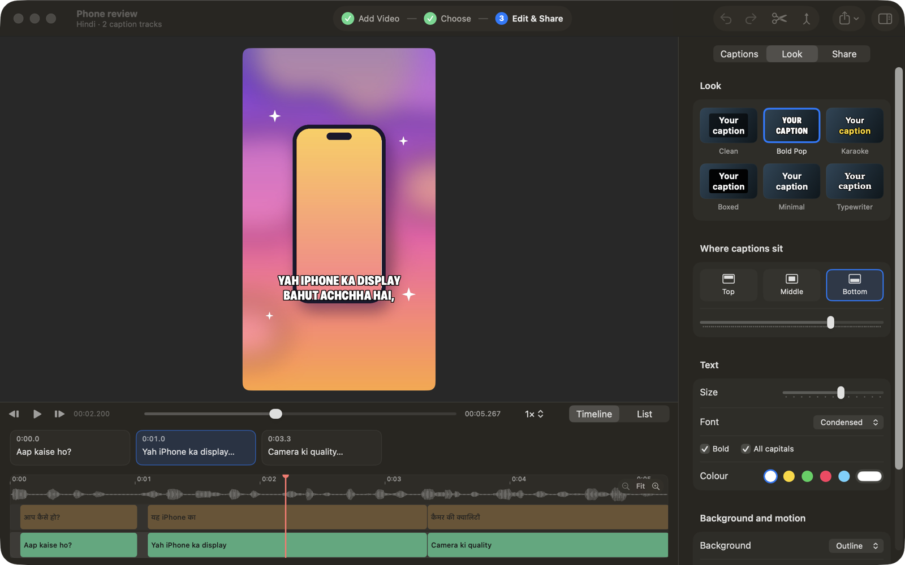
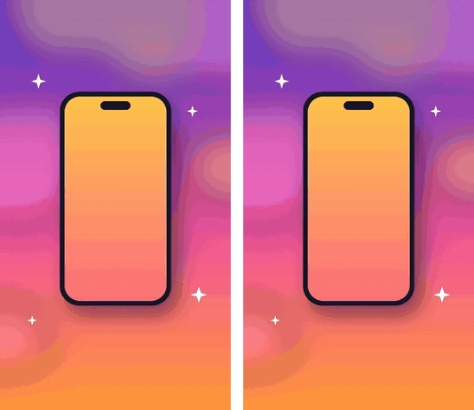
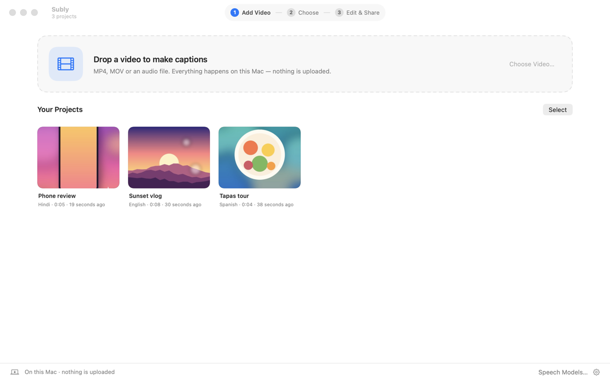
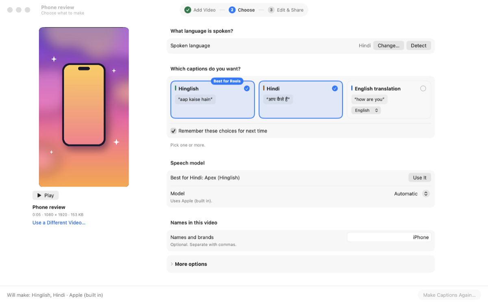
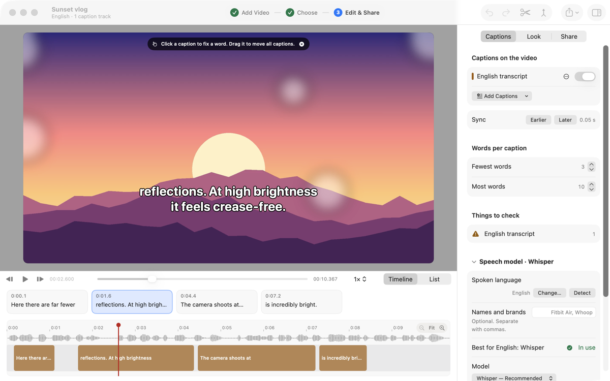

<div align="center">



# Subly

**Captions for your videos, made right on your Mac.**<br>
The words you said, the same words in English letters, and a translation — all perfectly in sync.

[](https://github.com/DhananjayBhosale/Subly/releases/latest)
[](https://subly.dhananjaytech.app)

   



</div>

## ✨ What Subly makes

Drop in a Reel, a vlog or a podcast. From one listen, Subly makes up to three caption tracks that share exactly the same timings:

| 🗣️ As spoken | 🔤 In English letters | 🌍 Translated |
|:---:|:---:|:---:|
| आप कैसे हो? | Aap kaise ho? | How are you? |
| The transcript, in the language's own script | Great for Hinglish Reels — Hindi written the way people type it | Into English, Spanish, French and more, using Apple's on-device translation |

Then burn them into the video, Reels-style:

<div align="center">

<br><sub>Karaoke and Bold Pop looks, exported by Subly from a demo reel</sub>
</div>

## 🎬 Three easy steps

<table>
<tr>
<td width="33%" align="center"><b>1 · Add Video</b><br><sub>Drop a file. Your projects wait for you here.</sub><br><br></td>
<td width="33%" align="center"><b>2 · Choose</b><br><sub>Check the language (Subly detects it when the Whisper model is installed) and tick the captions you want.</sub><br><br></td>
<td width="33%" align="center"><b>3 · Edit & Share</b><br><sub>Fix a word, pick a look, save the video or an SRT.</sub><br><br></td>
</tr>
</table>

## 💡 Things you'll like

- **🔒 Private by design.** Speech and translation run on your Mac. Nothing is uploaded.
- **🎯 In sync.** Long videos are cut at pauses and keep real word timings. Still a hair off? **Sync** nudges every caption 0.05 s earlier or later.
- **✋ Edit on the video.** Click a caption to fix a word, click away to save. Drag it to move all captions up or down.
- **🧠 Learns your spelling.** Change "yah" to "ye" once and Subly writes "ye" in every new caption. See or forget what it learned in Settings › Languages.
- **🎨 Caption looks.** Clean, Bold Pop, Karaoke, Boxed, Minimal, Typewriter and Gradient Pop, where each word fills with colour as it's said. Then pick the size, font (Instrument Serif included), italics, a solid or gradient colour for the text and the box, a highlight for the spoken word, and where captions sit.
- **🇮🇳 Made for Hinglish.** The optional Apex model writes Hindi straight into English letters. Add names and brands ("iPhone", "Fitbit Air") so they're spelled right.
- **📤 Share anywhere.** A video with captions burned in for Instagram, Reels and Shorts, or SRT, VTT, TXT and JSON files for YouTube and editors.
- **↩️ Undo everything.** Even Listen Again, which redoes the whole video.

## 📥 Install

1. Download **Subly.dmg** from the [latest release](https://github.com/DhananjayBhosale/Subly/releases/latest), open it and drag **Subly** to **Applications**.
2. Open Subly. Because it isn't notarized by Apple yet, macOS says it can't check it. Click **Done**.
3. Open **System Settings › Privacy & Security**, scroll down and click **Open Anyway** next to Subly. You only do this once.

You need an Apple Silicon Mac with **macOS 26** or later.

## 🧭 Good to know

- **Speech models are optional downloads.** Apple's built-in speech works out of the box for many languages. Whisper (about 99 languages), Apex (Hinglish) and 34 models made for one language download inside the app, under Speech Models, only when you ask.
- **Translation needs the language pair in macOS.** The first time, macOS may ask to download it.
- **Still young.** Accuracy on noisy, multi-speaker audio hasn't been measured, Japanese and Chinese romanization is basic, and the app isn't sandboxed. [`docs/KNOWN_LIMITS.md`](docs/KNOWN_LIMITS.md) lists the known gaps.

<details>
<summary><b>🛠️ Build from source</b></summary>

You need macOS 26, Xcode 27 or later, and an Apple Silicon Mac.

```bash
git clone https://github.com/DhananjayBhosale/Subly.git
cd Subly
./Scripts/build_engine.sh   # optional: builds the whisper.cpp runtime (needs cmake)
./Scripts/run.sh            # builds build/Subly.app, signs it ad-hoc, opens it
```

- `./Scripts/build_app.sh release` builds without launching.
- `./Scripts/make_dmg.sh` builds the app and wraps it in `build/Subly-<version>.dmg`.
- For a release that opens anywhere without the Open Anyway step, build with
  `SIGN_IDENTITY="Developer ID Application: …" ./Scripts/build_app.sh release`, then
  notarize and staple it with `xcrun notarytool` and `xcrun stapler`.
- Skip `build_engine.sh` and the app still works with Apple's speech engines. Only the
  optional models need the whisper.cpp runtime, which is not in git.

See `CONTRIBUTING.md` for tests and the headless check harnesses. `swift test` runs 204 tests.

</details>

<details>
<summary><b>🧠 Speech models</b></summary>

Speech recognition goes to Apple's engines (`SpeechTranscriber`, then `DictationTranscriber`) where macOS supports the language. These optional models run through whisper.cpp. Memory is the app's own rough estimate while running, not a benchmark.

| Engine | Model | Download | Memory (approx.) | Notes |
|---|---|---|---|---|
| Apex | Whisper-Hindi2Hinglish-Apex, q5_0 | 574 MB | 1.1 GB | Hindi only. Writes Hinglish straight from audio. Experimental. |
| Whisper | large-v3-turbo, q5_0 | 574 MB | 1.1 GB | About 99 languages. The default general model. |
| Whisper Large | large-v3, q5_0 | 1.08 GB | 1.9 GB | The most accurate and by far the slowest. |
| Whisper Medium | medium, q5_0 | 539 MB | 0.9 GB | Smaller and faster than the default. |
| Whisper Small | small, q5_1 | 190 MB | 0.4 GB | Less accurate on accented or mixed-language speech. |
| Whisper Base | base, q5_1 | 60 MB | 0.2 GB | Only for very tight machines. Makes frequent mistakes. |

Apex was compared with the other engines on one 58-second Hinglish clip (`docs/ENGINE_COMPARISON.md`) and on one synthetic clip. That is not a benchmark.

**Made for one language.** Fine-tunes of Whisper published by people who work on each language, run by the same whisper.cpp. Subly recommends one over general Whisper only where its makers or an independent benchmark publish numbers showing it does better (★); the evidence is shown beside it in the app. Before release each was downloaded, checksum-checked and run on a sentence spoken by the macOS voice for its language (Latvian, Persian, Estonian, Azerbaijani, Icelandic and Uzbek have no macOS voice, so those were only checked to load and run); none has been measured on real creator videos.

| Language | Models |
|---|---|
| Chinese | Belle Mandarin ★, Belle Mandarin Large, Breeze Taiwan (Traditional, Mandarin–English mixing) |
| Cantonese | Whisper Cantonese ★ |
| English | Whisper Medium / Small / Base English |
| Swedish | KB-Whisper Swedish ★, Medium, Small |
| Norwegian | NB-Whisper Norwegian ★, Medium |
| Finnish | Whisper Finnish ★, Whisper Finnish Turbo |
| German · Russian · Croatian | Whisper German ★ · Whisper Russian ★ · Whisper Croatian ★ |
| Thai | Pathumma Thai ★, Thonburian Thai |
| Vietnamese | PhoWhisper Vietnamese ★, PhoWhisper Vietnamese Small |
| Hebrew | ivrit.ai Hebrew ★ |
| Also | French, Turkish, Latvian, Estonian, Icelandic, Korean, Arabic dialects, Persian, Azerbaijani, Uzbek, Bengali, Tamil |

How each was chosen, the numbers, and what was left out and why: `docs/MODEL_RESEARCH.md`.

</details>

<details>
<summary><b>⚙️ How it works</b></summary>

One speech pass produces a timing spine: words with audio time ranges. The spine is cut into caption slots once, and every track fills the same slots, so timings are identical across tracks by construction. Where one track needs more room, the slot is split once and all tracks follow.

| Target | Role |
|---|---|
| `SublyCaptions` | Deterministic caption core. Foundation only. Timing, segmentation, caption rules, romanization, SRT/VTT/TXT/JSON writers, project format. Most tests are here. |
| `SublyEngine` | Speech, translation, model routing, capability registry, model downloads. |
| `SublyTranslate` | Bridge to a SwiftUI-attached `TranslationSession`. |
| `SublyApp` | The SwiftUI interface. |

`subly-cli` and `subly-bench` are headless harnesses. More documents:

- `docs/KNOWN_LIMITS.md`: what Subly does not do yet, stated plainly.
- `docs/MODEL_RESEARCH.md`: how the models were chosen, and what is not yet proven.
- `docs/ENGINE_COMPARISON.md`: the one real-clip engine comparison.

</details>

## 📄 Licence and credits

Subly is released under the MIT licence. See `LICENSE`. It uses, and does not claim any of:

- OpenAI Whisper, the speech recognition models (MIT)
- ggml-org/whisper.cpp, the runtime, v1.9.4, and the GGML model conversions hosted in its Hugging Face repository (MIT)
- Oriserve's Whisper-Hindi2Hinglish-Apex, as a GGML conversion hosted by Marquestra (Apache-2.0, as stated on the model page)
- The language models, each by its publisher under its own licence (Apache-2.0, MIT, BSD-3-Clause or CC-BY-4.0), named with its licence in the app: BELLE-2, MediaTek Research, alvanlii, KBLab (National Library of Sweden), the National Library of Norway, primeline, bond005, GoranS, bofenghuang, AiLab IMCS UL, Finnish-NLP, mozilla-ai, TurkMedSTT, NECTEC, biodatlab, VinAI Research, ivrit.ai, oddadmix, SadeghK, tugstugi, vasista22 (IIT Madras), TalTechNLP, LocalDoc, Reykjavik University's Language and Voice Lab (CC-BY-4.0), rubaiSTT and royshilkrot; GGML conversions by their authors or the converters named in the app
- Instrument Serif by the Instrument Serif Project Authors, the caption font, bundled in the app (SIL Open Font License 1.1, in `Resources/Licenses/InstrumentSerif-OFL.txt`)

The app's third-party notices are in Settings › About › Acknowledgements. The demo videos in these screenshots were drawn for this page.
